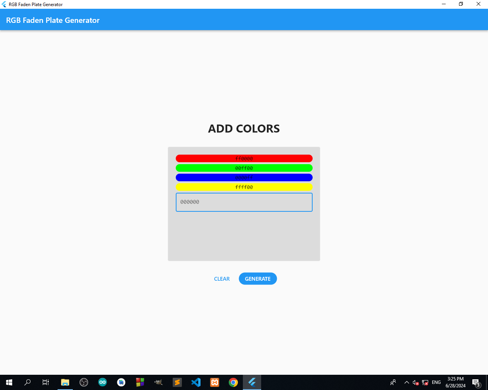
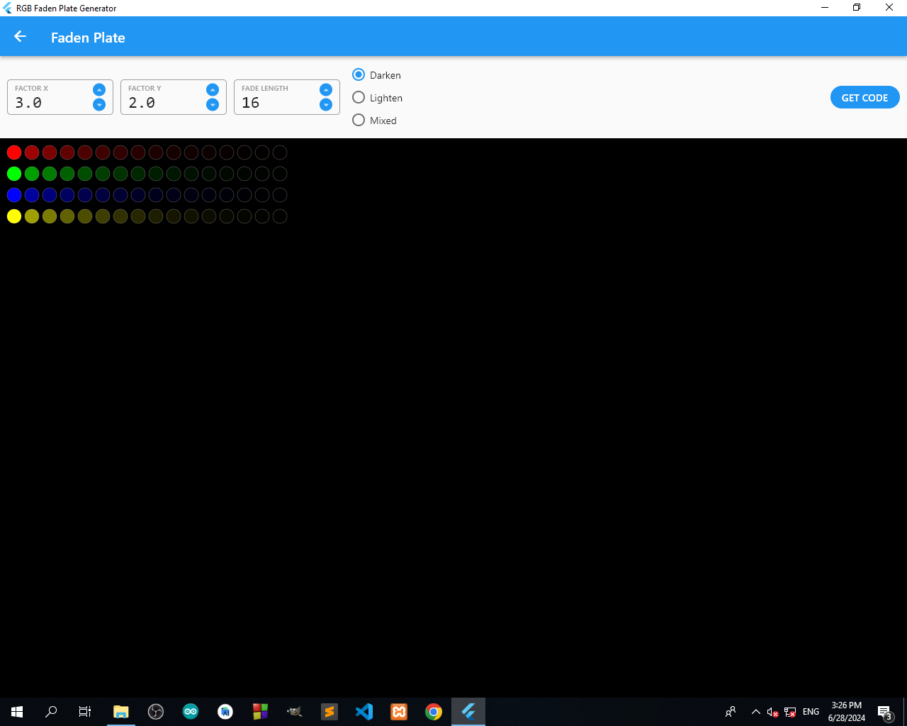
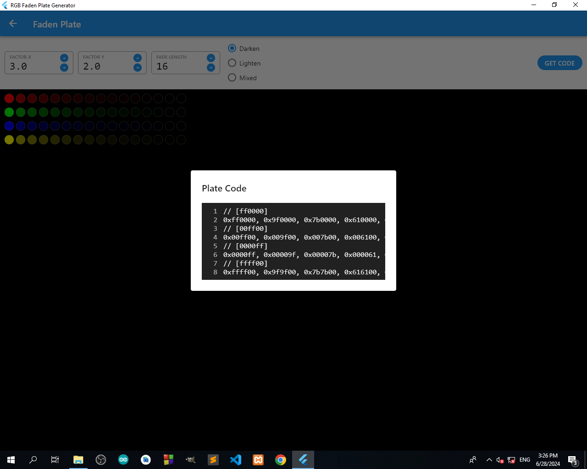

# RGB Faden Plate Generator

RGB Faden Plate Generator is a Flutter application designed to help users generate color fade plates with customizable color options, factors, fade lengths, and modes (darken, lighten, or mixed).

## Features

- Add multiple colors with hex values.
- Customize fade factors (Factor X, Factor Y).
- Set fade length.
- Choose from darken, lighten, or mixed fade modes.
- Generate and view the fade plate.
- Obtain the plate code in a formatted manner.

## Screenshots

### Add Colors

In this screen, users can add multiple colors using their hex values.

### Faden Plate

This screen allows users to set fade factors, fade length, and choose the fade mode. The generated fade plate is displayed here.

### Plate Code

Users can get the generated plate code in a formatted manner for further use.

## How to Use

1. **Add Colors:**
   - Enter the hex value of the color in the input box.
   - Click on the "Add" button to add the color to the list.
   - Repeat the process to add multiple colors.

2. **Generate Faden Plate:**
   - Set the Factor X and Factor Y values.
   - Set the Fade Length value.
   - Choose the fade mode (Darken, Lighten, Mixed).
   - Click on the "Generate" button to create the fade plate.

3. **Get Plate Code:**
   - After generating the fade plate, click on the "Get Code" button.
   - The plate code will be displayed in a formatted manner.

## Installation

To run this project locally:

1. Ensure you have Flutter installed. For installation instructions, visit the [official Flutter documentation](https://flutter.dev/docs/get-started/install).

2. Clone this repository:

   ```bash
   git clone https://github.com/tharushaudana/rgb_faden_plate_generator_flutter.git
   cd rgb_faden_plate_generator_flutter
   ```

3. Install the dependencies:

   ```bash
   flutter pub get
   ```

4. Run the application:

   ```bash
   flutter run
   ```

## License

This project is licensed under the MIT License. See the [LICENSE](LICENSE) file for details.

## Contributing

Contributions are welcome! Please open an issue or submit a pull request for any improvements or suggestions.
